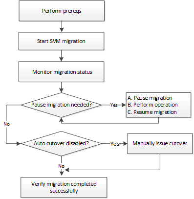

= SVM migration overview
:icons: font
:imagesdir: ../media/

[.lead]
Beginning with ONTAP 9.10.1, cluster administrators can non-disruptively relocate an SVM from a source cluster to a destination cluster to manage capacity and load balancing, or to enable equipment upgrades or data center consolidations. The feature is supported only on AFF arrays in ONTAP 9.10.1. iSCSI workloads are not supported.

The SVM’s name and UUID remain unchanged after migration, as well as the data LIF name, IP address, and object names, such as the volume name. The UUID of the objects in the SVM will be different.

== SVM migration workflow

The diagram depicts the typical workflow for an SVM migration. You start an SVM migration from the destination cluster. You can monitor the migration from either the source or the destination. You can perform a manual cutover or an automatic cutover. An automatic cutover is performed by default.

== Supported configurations

The following configurations are supported:

* AFF arrays only
* Only two node clusters on the source and on the destination
* Migrate within data centers and a maximum network latency of 2ms

== Prerequisites

* You are a cluster administrator
* The source and destination clusters are peered to each other
* The source and destination clusters have the Data Protection Bundle license installed
* All nodes in the source cluster must be running ONTAP 9.10.1 or later
* All nodes in the source cluster must be running the same ONTAP version
* The destination cluster is at the same or newer effective cluster version (ECV) as the source cluster
* The source and destination clusters are in the same L2 network and must be in the same VLAN
* The source SVM contains fewer than the maximum number of supported data volumes for the release.
+
In ONTAP 9.10.1, the maximum number of data volumes supported is 100.
* Sufficient space for volume placement is available on the destination
* Onboard Key Manager must be configured on the destination if the source SVM has encrypted volumes

== Conflicting operations

You should check for operations that can conflict with an SVM migration:

* No failover operations are in progress
* WAFLIRON cannot be running
* Fingerprint is not in progress
* SMTape is not in progress
* Vol move, rehost, clone, create, convert or analytics are not running

== Supported features

The following features are supported with ONTAP 9.10.1:

* NFS v3, NFS v4.1, and NFS v4.2 protocols
* NetApp Volume Encryption

== Unsupported features

The following features are not supported with SVM migration:

* iSCSI workloads
* IPv6 LIFs
* SVM migration when the source cluster's Onboard Key Manager (OKM) has Common Criteria (CC) mode enabled
* SVM peering, SnapMirror, data protection volume
* SAN, NVMe over fiber, CIFS, VSCAN, NFS v4.0, vStorage, S3 replication
* Auditing
* NDMP
* VIP/BGP LIF
* IPsec policy
* Anti-ransomware
* Qtree, Quota
* SVM-DR
* External Key Manager at the destination cluster
* SnapMirror
* SnapLock
* FlexGroups
* FlexCache
* FabricPools
* Flash Pool aggregates
* MetroCluster
* System Manager
* VSC
* Volume clones
* FAS arrays
* Load-sharing mirrors
* Cloud Volumes ONTAP

// 2021-11-1, Jira IE-330
