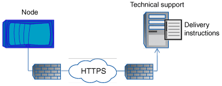

= How AutoSupport OnDemand obtains delivery instructions from technical support
:icons: font
:imagesdir: ../media/

[.lead]
AutoSupport OnDemand periodically communicates with technical support to obtain delivery instructions for sending, resending, and declining AutoSupport messages as well as uploading large files to the NetApp support site. AutoSupport OnDemand enables AutoSupport messages to be sent on-demand instead of waiting for the weekly AutoSupport job to run.

AutoSupport OnDemand consists of the following components:

* AutoSupport OnDemand client that runs on each node
* AutoSupport OnDemand service that resides in technical support

The AutoSupport OnDemand client periodically polls the AutoSupport OnDemand service to obtain delivery instructions from technical support. For example, technical support can use the AutoSupport OnDemand service to request that a new AutoSupport message be generated. When the AutoSupport OnDemand client polls the AutoSupport OnDemand service, the client obtains the delivery instructions and sends the new AutoSupport message on-demand as requested.

AutoSupport OnDemand is enabled by default. However, AutoSupport OnDemand relies on some AutoSupport settings to continue communicating with technical support. AutoSupport OnDemand automatically communicates with technical support when the following requirements are met:

* AutoSupport is enabled.
* AutoSupport is configured to send messages to technical support.
* AutoSupport is configured to use the HTTPS transport protocol.

The AutoSupport OnDemand client sends HTTPS requests to the same technical support location to which AutoSupport messages are sent. The AutoSupport OnDemand client does not accept incoming connections.

[NOTE]
====
AutoSupport OnDemand uses the "`autosupport`" user account to communicate with technical support. ONTAP prevents you from deleting this account.
====

If you want to disable AutoSupport OnDemand, but keep AutoSupport enabled, use the command: link:https://docs.netapp.com/us-en/ontap-cli/system-node-autosupport-modify.html#parameters[`system node autosupport modify -ondemand-state disable`].

The following illustration shows how AutoSupport OnDemand sends HTTPS requests to technical support to obtain delivery instructions.

The delivery instructions can include requests for AutoSupport to do the following:

* Generate new AutoSupport messages.
+
Technical support might request new AutoSupport messages to help triage issues.

* Generate new AutoSupport messages that upload core dump files or performance archive files to the NetApp support site.
+
Technical support might request core dump or performance archive files to help triage issues.

* Retransmit previously generated AutoSupport messages.
+
This request automatically happens if a message was not received due to a delivery failure.

* Disable delivery of AutoSupport messages for specific trigger events.
+
Technical support might disable delivery of data that is not used.

// 2024 may 16, ontapdoc-1986
// 2022-08-03, BURT 1485042
