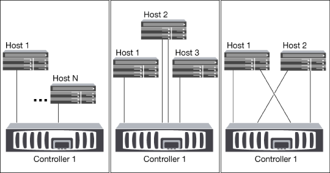
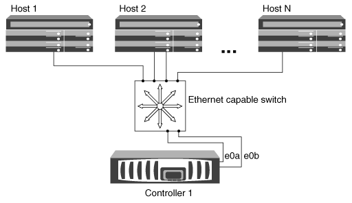
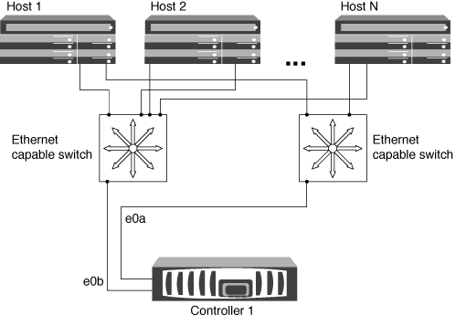
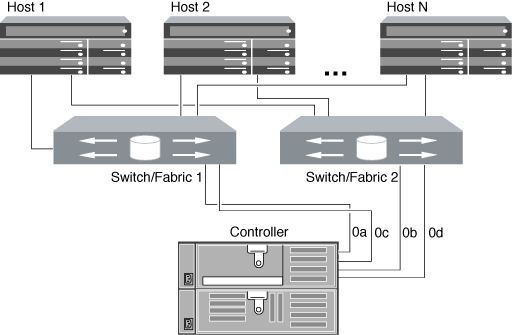

= Manage single-node clusters
:icons: font
:imagesdir: ../media/

[.lead]

A single-node cluster is a special implementation of a cluster running on a standalone node.  Single-node clusters are not recommended because they do not provide redundancy.  If the node goes down, data access is lost. 

[NOTE]
====
For fault tolerance and nondisruptive operations, it is highly recommended that you configure your cluster with link:../concepts/high-availability-pairs-concept.html[high-availability (HA pairs)]. 
====

For single-node clusters you should be aware of the following:

* Root volume encryption is not supported on single-node configurations.
* If you remove nodes to have a single-node cluster, you should modify the cluster ports to serve data traffic by modifying the cluster ports to be data ports, and then creating data LIFs on the data ports.
* For single-node clusters (including Data ONTAP Edge systems), you can specify the configuration backup destination during software setup. After setup, those settings can be modified using ONTAP commands.

== Ways to configure iSCSI SAN hosts with single nodes

You can configure iSCSI SAN hosts to connect directly to a single node or to connect through one or more IP switches. If there are multiple hosts connecting to the node, each host can be configured with a different operating system. For single and multi-network configurations, the node can have multiple iSCSI connections to the switch, but multipathing software that supports ALUA is required.

[NOTE]
====
If there are multiple paths from the host to the controller, then ALUA must be enabled on the host.
====

.Direct-attached single-node configurations

In direct-attached configurations, one or more hosts are directly connected to the node.

.Single-network single-node configurations

In single-network single-node configurations, one switch connects a single node to one or more hosts. Because there is a single switch, this configuration is not fully redundant.

.Multi-network single-node configurations

In multi-network single-node configurations, two or more switches connect a single node to one or more hosts. Because there are multiple switches, this configuration is fully redundant.

== Ways to configure FC and FC-NVMe SAN hosts with single nodes

You can configure FC and FC-NVMe SAN hosts with single nodes through one or more fabrics. N-Port ID Virtualization (NPIV) is required and must be enabled on all FC switches in the fabric. You cannot directly attach FC or FC-NMVE SAN hosts to single nodes without using an FC switch.

.Single-fabric single-node configurations

In single-fabric single-node configurations, there is one switch connecting a single node to one or more hosts. Because there is a single switch, this configuration is not fully redundant. All hardware platforms that support FC and FC-NVMe support single-fabric single-node configurations. 

In single-fabric single-node configurations, multipathing software is not required if you only have a single path from the host to the node.

.Multifabric single-node configurations

In multifabric single-node configurations, there are two or more switches connecting a single node to one or more hosts. For simplicity, the following figure shows a multifabric single-node configuration with only two fabrics, but you can have two or more fabrics in any multifabric configuration. In this figure, the storage controller is mounted in the top chassis and the bottom chassis can be empty or can have an IOMX module, as it does in this example.

The FC target ports (0a, 0c, 0b, 0d) in the illustrations are examples. The actual port numbers vary depending on the model of your storage node and whether you are using expansion adapters.

.Related information

http://www.netapp.com/us/media/tr-4684.pdf[NetApp Technical Report 4684: Implementing and Configuring Modern SANs with NVMe-oF^]

== ONTAP upgrade for single-node cluster

Beginning with ONTAP 9.2, you can use the ONTAP CLI to perform an automated update of a single-node cluster. Because single-node clusters lack redundancy, updates are always disruptive. Disruptive upgrades cannot be performed using System Manager.

* You must have completed upgrade link:../upgrade/prepare.html[preparation] steps.

.Steps

. Delete the previous ONTAP software package: 
+
[source,cli]
----
cluster image package delete -version previous_package_version
----

. Download the target ONTAP software package: 
+
[source,cli]
----
cluster image package get -url location
----
+
----
cluster1::> cluster image package get -url http://www.example.com/software/9.7/image.tgz

Package download completed.
Package processing completed.
----

. Verify that the software package is available in the cluster package repository: 
+
[source,cli]
----
cluster image package show-repository
----
+
----
cluster1::> cluster image package show-repository
Package Version  Package Build Time
---------------- ------------------
9.7              M/DD/YYYY 10:32:15
----

. Verify that the cluster is ready to be upgraded: 
+
[source,cli]
----
cluster image validate -version package_version_number
----
+
----
cluster1::> cluster image validate -version 9.7

WARNING: There are additional manual upgrade validation checks that must be performed after these automated validation checks have completed...
----

. Monitor the progress of the validation: 
+
[source,cli]
----
cluster image show-update-progress
----

. Complete all required actions identified by the validation.
. Optionally, generate a software upgrade estimate: 
+
[source,cli]
----
cluster image update -version package_version_number -estimate-only
----
+
The software upgrade estimate displays details about each component to be updated, and the estimated duration of the upgrade.

. Perform the software upgrade: 
+
[source,cli]
----
cluster image update -version package_version_number
----
+
NOTE: If an issue is encountered, the update pauses and prompts you to take corrective action. You can use the cluster image show-update-progress command to view details about any issues and the progress of the update. After correcting the issue, you can resume the update by using the cluster image resume-update command.

. Display the cluster update progress: 
+
[source,cli]
----
cluster image show-update-progress
----
+
The node is rebooted as part of the update and cannot be accessed while rebooting.

. Trigger a notification: 
+
[source,cli]
----
autosupport invoke -node * -type all -message "Finishing_Upgrade"
----
+
If your cluster is not configured to send messages, a copy of the notification is saved locally.

// 2024 Mar 26, Jira 1810
// 2023 Dec 12, Jira 1275
// 2023-12-07, ONTAPDOC-1007
// 2023 Nov 09, Jira 1466