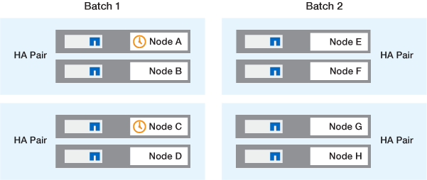
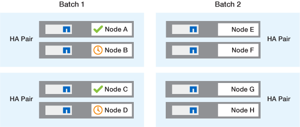
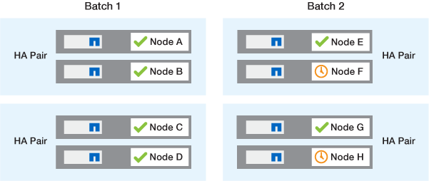

= ONTAP software upgrade methods
:icons: font
:imagesdir: ../media/

[.lead]

You can perform an automated upgrade of your ONTAP software using System Manage. Alternately, you can perform an automated or manual upgrade using the ONTAP command line interface (CLI). The method you use to upgrade ONTAP depends upon your configuration, your current ONTAP version, and the number of nodes in your cluster. NetApp recommends using System Manager to perform automated upgrades unless your configuration requires a different approach. For example, if you have a MetroCluster configuration with 4 nodes running ONTAP 9.3 or later, you should use System Manager to perform an automated upgrade (sometimes referred to as automated nondisruptive upgrade or ANDU). If you have a MetroCluster configuration with 8 nodes running ONTAP 9.2 or earlier, you should use the CLI to perform a manual upgrade. 

An upgrade can be executed using the rolling upgrade process or the batch upgrade process. Both are nondisruptive.

For automated upgrades, ONTAP automatically installs the target ONTAP image on each node, validates the cluster components to ensure that the cluster can be upgraded nondisruptively, and then executes a batch or rolling upgrade in the background based on the number of nodes. For manual upgrades, the administrator manually confirms that each node in the cluster is ready for upgrade, then performs steps to execute a rolling upgrade. 

.ONTAP rolling upgrades

The rolling upgrade process is the default for clusters with fewer than 8 nodes.  In the rolling upgrade process, a node is taken offline and upgraded while its partner takes over its storage. When the node upgrade is complete, the partner node gives control back to the original owning node, and the process is repeated on the partner node. Each additional HA pair is upgraded in sequence until all HA pairs are running the target release. 

.ONTAP batch upgrades

The batch upgrade process is the default for clusters of 8 nodes or more.  In the batch upgrade process, the cluster is divided into two batches.  Each batch contains multiple HA pairs. In the first batch, the first node of each HA pair is simultaneously upgraded with the first node of all other HA pairs in the batch. 

In following example, there are two HA pairs in each batch.  When the batch upgrade begins, Node A and Node C are upgraded simultaneously.

After the upgrade of the first nodes of each HA pair is complete, then the partner nodes in batch 1 are simultaneously upgraded. 

In the following example, after Node A and Node C are upgraded, then Node B and Node D are simultaneously upgraded.

The process is then repeated for the nodes in batch 2; the first node of each HA pair is simultaneously upgraded with the first node of all other HA pairs in the batch. 

In the following example, Node E and Node G are upgraded simultaneously.

After the upgrade of the first nodes of each HA pair is complete, then the partner nodes in batch 2 are simultaneously upgraded. 

In the following example, Node F and Node H are simultaneously upgraded to complete the batch upgrade process.

== Recommended ONTAP upgrade methods based on configuration

Upgrade methods supported by your configuration are listed in order of recommended usage.

[cols=4,options="header"]
|===
| Configuration
| ONTAP version
| Number of nodes
| Recommended upgrade method

| Standard
| 9.0 or later
| 2 or more
a| * xref:task_upgrade_andu_sm.html[Automated nondisruptive using System Manager]
* xref:task_upgrade_andu_cli.html[Automated nondisruptive using the CLI]

| Standard
| 9.0 or later
| Single
| xref:task_upgrade_disruptive_automated_cli.html[Automated disruptive]

| MetroCluster
| 9.3 or later
| 8
a| * xref:task_upgrade_andu_cli.html[Automated nondisruptive using the CLI]
* xref:task_updating_a_four_or_eight_node_mcc.html[Manual nondisruptive for 4 or 8 node MetroCluster using the CLI]

| MetroCluster
| 9.3 or later
| 2,4
a| * xref:task_upgrade_andu_sm.html[Automated nondisruptive using System Manager]
* xref:task_upgrade_andu_cli.html[Automated nondisruptive using the CLI]

| MetroCluster
| 9.2 or earlier
| 4, 8
| xref:task_updating_a_four_or_eight_node_mcc.html[Manual nondisruptive for 4 or 8 node MetroCluster using the CLI]

| MetroCluster
| 9.2 or earlier
| 2
| xref:task_updating_a_two_node_metrocluster_configuration_in_ontap_9_2_and_earlier.html[Manual nondisruptive for 2-node MetroCluster using the CLI]

|===

ANDU using System Manager is the recommended upgrade method for all patch upgrades regardless of configuration.  

[NOTE]
A xref:task_updating_an_ontap_cluster_disruptively.html[manual disruptive upgrade] can be performed on any configuration.  However, you should not perform a disruptive upgrade unless you can take the cluster offline for the duration of the upgrade. If you are operating in a SAN environment, you should be prepared to shut down or suspend all SAN clients before performing a disruptive upgrade. Disruptive upgrades are performed using the ONTAP CLI.

// 2024 Mar 27, Jira 1852
// 2023 Oct 24, Git Issue 1149
// 2023 Sept 29, Jira 1327 
// 2023 Aug 30, Jira 1257
// 2022-03-07, BURT 1458608
//2021-12-22, BURT 1447276
