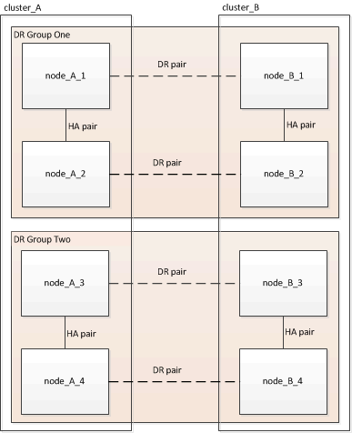

= Manual nondisruptive ONTAP upgrade of a four- or eight-node MetroCluster configuration using the CLI
:icons: font
:imagesdir: ../media/

[.lead]
The manual update procedure for upgrading or downgrading a four- or eight-node MetroCluster configuration involves preparing for the update, updating the DR pairs in each of the one or two DR groups simultaneously, and performing some post-update tasks.

* This task applies to the following configurations:
 ** Four-node MetroCluster FC or IP configurations running ONTAP 9.2 or earlier
 ** Eight-node MetroCluster FC configurations, regardless of ONTAP version
* If you have a two-node MetroCluster configuration, do not use this procedure.
* The following tasks refer to the old and new versions of ONTAP.
 ** When upgrading, the old version is a previous version of ONTAP, with a lower version number than the new version of ONTAP.
 ** When downgrading, the old version is a later version of ONTAP, with a higher version number than the new version of ONTAP.
* This task uses the following high-level workflow:
+
image::../media/workflow_mcc_lockstep_upgrade.gif[Diagram of MetroCluster upgrade decision flow.]

== Differences when updating software on an eight-node or four-node MetroCluster configuration

The MetroCluster software update process differs, depending on whether there are eight or four nodes in the MetroCluster configuration.

A MetroCluster configuration consists of one or two DR groups. Each DR group consists of two HA pairs, one HA pair at each MetroCluster cluster. An eight-node MetroCluster includes two DR groups:

The MetroCluster software update procedure involves upgrading or downgrading one DR group at a time.

For four-node MetroCluster configurations:

. Update DR Group One:
.. Update node_A_1 and node_B_1.
.. Update node_A_2 and node_B_2.

For eight-node MetroCluster configurations, you perform the DR group update procedure twice:

. Update DR Group One:
.. Update node_A_1 and node_B_1.
.. Update node_A_2 and node_B_2.
. Update DR Group Two:
.. Update node_A_3 and node_B_3.
.. Update node_A_4 and node_B_4.

== Preparing to update a MetroCluster DR group

Before you actually update the software on the nodes, you must identify the DR relationships among the nodes, send an AutoSupport message that you are initiating an update, and confirm the ONTAP version running on each node.

You must have xref:task_download_and_install_ontap_software_image.html[downloaded and installed the software images].

This task must be repeated on each DR group. If the MetroCluster configuration consists of eight nodes, there are two DR groups. Thereby, this task must be repeated on each DR group.

The examples provided in this task use the names shown in the following illustration to identify the clusters and nodes:

. Identify the DR pairs in the configuration: `metrocluster node show -fields dr-partner`
+
----
 cluster_A::> metrocluster node show -fields dr-partner
   (metrocluster node show)
 dr-group-id cluster     node       dr-partner
 ----------- -------     --------   ----------
 1           cluster_A   node_A_1   node_B_1
 1           cluster_A   node_A_2   node_B_2
 1           cluster_B   node_B_1   node_A_1
 1           cluster_B   node_B_2   node_A_2
 4 entries were displayed.

 cluster_A::>
----

. Set the privilege level from admin to advanced, entering *y* when prompted to continue: `set -privilege advanced`
+
The advanced prompt (`*>`) appears.

. Confirm the ONTAP version running on each node:
.. Confirm the version on cluster_A: `system image show`
+
----
 cluster_A::*> system image show
                  Is      Is                Install
 Node     Image   Default Current Version   Date
 -------- ------- ------- ------- -------   -------------------
 node_A_1
          image1  true    true    X.X.X     MM/DD/YYYY TIME
          image2  false   false   Y.Y.Y     MM/DD/YYYY TIME
 node_A_2
          image1  true    true    X.X.X     MM/DD/YYYY TIME
          image2  false   false   Y.Y.Y     MM/DD/YYYY TIME
 4 entries were displayed.

 cluster_A::>
----

.. Confirm the version on cluster_B: `system image show`
+
----
 cluster_B::*> system image show
                  Is      Is                 Install
 Node     Image   Default Current Version    Date
 -------- ------- ------- ------- -------    -------------------
 node_B_1
          image1  true    true    X.X.X      MM/DD/YYYY TIME
          image2  false   false   Y.Y.Y      MM/DD/YYYY TIME
 node_B_2
          image1  true    true    X.X.X      MM/DD/YYYY TIME
          image2  false   false   Y.Y.Y      MM/DD/YYYY TIME
 4 entries were displayed.

 cluster_B::>
----
. Trigger an AutoSupport notification: `autosupport invoke -node * -type all -message "Starting_NDU"`
+
This AutoSupport notification includes a record of the system status before the update. It saves useful troubleshooting information if there is a problem with the update process.
+
If your cluster is not configured to send AutoSupport messages, then a copy of the notification is saved locally.

. For each node in the first set, set the target ONTAP software image to be the default image: `system image modify {-node nodename -iscurrent false} -isdefault true`
+
This command uses an extended query to change the target software image, which is installed as the alternate image, to be the default image for the node.

. Verify that the target ONTAP software image is set as the default image:
.. Verify the images on cluster_A: `system image show`
+
In the following example, image2 is the new ONTAP version and is set as the default image on each of the nodes in the first set:
+
----
 cluster_A::*> system image show
                  Is      Is              Install
 Node     Image   Default Current Version Date
 -------- ------- ------- ------- ------- -------------------
 node_A_1
          image1  false   true    X.X.X   MM/DD/YYYY TIME
          image2  true    false   Y.Y.Y   MM/DD/YYYY TIME
 node_A_2
          image1  false   true    X.X.X   MM/DD/YYYY TIME
          image2  true   false   Y.Y.Y   MM/DD/YYYY TIME

 2 entries were displayed.
----

.. Verify the images on cluster_B: `system image show`
+
The following example shows that the target version is set as the default image on each of the nodes in the first set:
+
----
 cluster_B::*> system image show
                  Is      Is              Install
 Node     Image   Default Current Version Date
 -------- ------- ------- ------- ------- -------------------
 node_A_1
          image1  false   true    X.X.X   MM/DD/YYYY TIME
          image2  true    false   Y.Y.Y   MM/YY/YYYY TIME
 node_A_2
          image1  false   true    X.X.X   MM/DD/YYYY TIME
          image2  true    false   Y.Y.Y   MM/DD/YYYY TIME

 2 entries were displayed.
----
. Determine whether the nodes to be upgraded are currently serving any clients twice for each node: `system node run -node target-node -command uptime`
+
The uptime command displays the total number of operations that the node has performed for NFS, CIFS, FC, and iSCSI clients since the node was last booted. For each protocol, you need to run the command twice to determine whether the operation counts are increasing. If they are increasing, the node is currently serving clients for that protocol. If they are not increasing, the node is not currently serving clients for that protocol.
+
*NOTE*: You should make a note of each protocol that has increasing client operations so that after the node is upgraded, you can verify that client traffic has resumed.
+
This example shows a node with NFS, CIFS, FC, and iSCSI operations. However, the node is currently serving only NFS and iSCSI clients.
+
----
 cluster_x::> system node run -node node0 -command uptime
   2:58pm up  7 days, 19:16 800000260 NFS ops, 1017333 CIFS ops, 0 HTTP ops, 40395 FCP ops, 32810 iSCSI ops

 cluster_x::> system node run -node node0 -command uptime
   2:58pm up  7 days, 19:17 800001573 NFS ops, 1017333 CIFS ops, 0 HTTP ops, 40395 FCP ops, 32815 iSCSI ops
----

== Updating the first DR pair in a MetroCluster DR group

You must perform a takeover and giveback of the nodes in the correct order to make the new version of ONTAP the current version of the node.

All nodes must be running the old version of ONTAP.

In this task, node_A_1 and node_B_1 are updated.

If you have updated the ONTAP software on the first DR group, and are now updating the second DR group in an eight-node MetroCluster configuration, in this task you would be updating node_A_3 and node_B_3.

. If MetroCluster Tiebreaker software is enabled, disabled it.
. For each node in the HA pair, disable automatic giveback: `storage failover modify -node target-node -auto-giveback false`
+
This command must be repeated for each node in the HA pair.

. Verify that automatic giveback is disabled: `storage failover show -fields auto-giveback`
+
This example shows that automatic giveback has been disabled on both nodes:
+
----
 cluster_x::> storage failover show -fields auto-giveback
 node     auto-giveback
 -------- -------------
 node_x_1 false
 node_x_2 false
 2 entries were displayed.
----

. Ensure that I/O is not exceeding ~50% for each controller. Ensure that CPU utilization is not exceeding ~50% per controller.
. Initiate a takeover of the target node on cluster_A:
+
Do not specify the -option immediate parameter, because a normal takeover is required for the nodes that are being taken over to boot onto the new software image.

.. Take over the DR partner on cluster_A (node_A_1):``storage failover takeover -ofnode node_A_1``
+
The node boots up to the "Waiting for giveback" state.
+
NOTE: If AutoSupport is enabled, then an AutoSupport message is sent indicating that the nodes are out of cluster quorum. You can ignore this notification and proceed with the upgrade.

.. Verify that the takeover is successful: `storage failover show`
+
The following example shows that the takeover is successful. Node_A_1 is in the "Waiting for giveback" state and node_A_2 is in the "In takeover" state.
+
----
 cluster1::> storage failover show
                               Takeover
 Node           Partner        Possible State Description
 -------------- -------------- -------- -------------------------------------
 node_A_1       node_A_2       -        Waiting for giveback (HA mailboxes)
 node_A_2       node_A_1       false    In takeover
 2 entries were displayed.
----

. Take over the DR partner on cluster_B (node_B_1):
+
Do not specify the -option immediate parameter, because a normal takeover is required for the nodes that are being taken over to boot onto the new software image.

.. Take over node_B_1: `storage failover takeover -ofnode node_B_1`
+
The node boots up to the "Waiting for giveback" state.
+
NOTE: If AutoSupport is enabled, then an AutoSupport message is sent indicating that the nodes are out of cluster quorum. You can ignore this notification and proceed with the upgrade.

.. Verify that the takeover is successful: `storage failover show`
+
The following example shows that the takeover is successful. Node_B_1 is in the "Waiting for giveback" state and node_B_2 is in the "In takeover" state.
+
----
 cluster1::> storage failover show
                               Takeover
 Node           Partner        Possible State Description
 -------------- -------------- -------- -------------------------------------
 node_B_1       node_B_2       -        Waiting for giveback (HA mailboxes)
 node_B_2       node_B_1       false    In takeover
 2 entries were displayed.
----

. Wait at least eight minutes to ensure the following conditions:
** Client multipathing (if deployed) is stabilized.
** Clients are recovered from the pause in I/O that occurs during takeover.
+
The recovery time is client-specific and might take longer than eight minutes depending on the characteristics of the client applications.
. Return the aggregates to the target nodes:
+
After upgrading MetroCluster IP configurations to ONTAP 9.5 or later, the aggregates will be in a degraded state for a short period before resynchronizing and returning to a mirrored state.

.. Give back the aggregates to the DR partner on cluster_A: `storage failover giveback –ofnode node_A_1`
.. Give back the aggregates to the DR partner on cluster_B: `storage failover giveback –ofnode node_B_1`
+
The giveback operation first returns the root aggregate to the node and then, after the node has finished booting, returns the non-root aggregates.

. Verify that all aggregates have been returned by issuing the following command on both clusters: `storage failover show-giveback`
+
If the Giveback Status field indicates that there are no aggregates to give back, then all aggregates have been returned. If the giveback is vetoed, the command displays the giveback progress and which subsystem vetoed the giveback.

. If any aggregates have not been returned, do the following:
.. Review the veto workaround to determine whether you want to address the "`veto`" condition or override the veto.
.. If necessary, address the "`veto`" condition described in the error message, ensuring that any identified operations are terminated gracefully.
.. Reenter the storage failover giveback command.
+
If you decided to override the "`veto`" condition, set the -override-vetoes parameter to true.
. Wait at least eight minutes to ensure the following conditions:
** Client multipathing (if deployed) is stabilized.
** Clients are recovered from the pause in I/O that occurs during giveback.
+
The recovery time is client-specific and might take longer than eight minutes depending on the characteristics of the client applications.
. Set the privilege level from admin to advanced, entering *y* when prompted to continue: `set -privilege advanced`
+
The advanced prompt (`*>`) appears.

. Confirm the version on cluster_A: `system image show`
+
The following example shows that System image2 should is the default and current version on node_A_1:
+
----
 cluster_A::*> system image show
                  Is      Is               Install
 Node     Image   Default Current Version  Date
 -------- ------- ------- ------- -------- -------------------
 node_A_1
          image1  false   false    X.X.X   MM/DD/YYYY TIME
          image2  true    true     Y.Y.Y   MM/DD/YYYY TIME
 node_A_2
          image1  false   true     X.X.X   MM/DD/YYYY TIME
          image2  true    false    Y.Y.Y   MM/DD/YYYY TIME
 4 entries were displayed.

 cluster_A::>
----

. Confirm the version on cluster_B: `system image show`
+
The following example shows that System image2 (ONTAP 9.0.0) is the default and current version on node_A_1:
+
----
 cluster_A::*> system image show
                  Is      Is               Install
 Node     Image   Default Current Version  Date
 -------- ------- ------- ------- -------- -------------------
 node_B_1
          image1  false   false    X.X.X   MM/DD/YYYY TIME
          image2  true    true     Y.Y.Y   MM/DD/YYYY TIME
 node_B_2
          image1  false   true     X.X.X   MM/DD/YYYY TIME
          image2  true    false    Y.Y.Y   MM/DD/YYYY TIME
 4 entries were displayed.

 cluster_A::>
----

== Updating the second DR pair in a MetroCluster DR group

You must perform a takeover and giveback of the node in the correct order to make the new version of ONTAP the current version of the node.

You should have upgraded the first DR pair (node_A_1 and node_B_1).

In this task, node_A_2 and node_B_2 are updated.

If you have updated the ONTAP software on the first DR group, and are now updating the second DR group in an eight-node MetroCluster configuration, in this task you are updating node_A_4 and node_B_4.

. Migrate all of the data LIFs away from the node: `network interface migrate-all -node nodenameA`

. Initiate a takeover of the target node on cluster_A:
+
Do not specify the -option immediate parameter, because a normal takeover is required for the nodes that are being taken over to boot onto the new software image.

 .. Take over the DR partner on cluster_A:
+
`storage failover takeover -ofnode node_A_2 -option allow-version-mismatch`
+
NOTE: The `allow-version-mismatch` option is not required for upgrades from ONTAP 9.0 to ONTAP 9.1 or for any patch upgrades.
+
The node boots up to the "Waiting for giveback" state.
+
If AutoSupport is enabled, then an AutoSupport message is sent indicating that the nodes are out of cluster quorum. You can ignore this notification and proceed with the upgrade.

 .. Verify that the takeover is successful: `storage failover show`
+
The following example shows that the takeover is successful. Node_A_2 is in the "Waiting for giveback" state and node_A_1 is in the "In takeover" state.
+
----
cluster1::> storage failover show
                              Takeover
Node           Partner        Possible State Description
-------------- -------------- -------- -------------------------------------
node_A_1       node_A_2       false    In takeover
node_A_2       node_A_1       -        Waiting for giveback (HA mailboxes)
2 entries were displayed.
----

. Initiate a takeover of the target node on cluster_B:
+
Do not specify the -option immediate parameter, because a normal takeover is required for the nodes that are being taken over to boot onto the new software image.

 .. Take over the DR partner on cluster_B (node_B_2):
+
[cols=2*,options="header"]
|===
| If you are upgrading from...| Enter this command...
a|
ONTAP 9.2 or        ONTAP 9.1
a|
`storage failover takeover -ofnode node_B_2`
a|
ONTAP 9.0 or        Data ONTAP 8.3.x
a|
`storage failover takeover -ofnode node_B_2 -option allow-version-mismatch`
NOTE: The `allow-version-mismatch` option is not required for upgrades from ONTAP 9.0 to ONTAP 9.1 or for any patch upgrades.
|===

The node boots up to the "Waiting for giveback" state.
+
NOTE: If AutoSupport is enabled, an AutoSupport message is sent indicating that the nodes are out of cluster quorum. You can safely ignore this notification and proceed with the upgrade.

 .. Verify that the takeover is successful: `storage failover show`
+
The following example shows that the takeover is successful. Node_B_2 is in the "Waiting for giveback" state and node_B_1 is in the "In takeover" state.
+
----
cluster1::> storage failover show
                              Takeover
Node           Partner        Possible State Description
-------------- -------------- -------- -------------------------------------
node_B_1       node_B_2       false    In takeover
node_B_2       node_B_1       -        Waiting for giveback (HA mailboxes)
2 entries were displayed.
----

. Wait at least eight minutes to ensure the following conditions:
 ** Client multipathing (if deployed) is stabilized.
 ** Clients are recovered from the pause in I/O that occurs during takeover.
+
The recovery time is client-specific and might take longer than eight minutes depending on the characteristics of the client applications.
. Return the aggregates to the target nodes:
+
After upgrading MetroCluster IP configurations to ONTAP 9.5, the aggregates will be in a degraded state for a short period before resynchronizing and returning to a mirrored state.

 .. Give back the aggregates to the DR partner on cluster_A: `storage failover giveback –ofnode node_A_2`
 .. Give back the aggregates to the DR partner on cluster_B: `storage failover giveback –ofnode node_B_2`

+
The giveback operation first returns the root aggregate to the node and then, after the node has finished booting, returns the non-root aggregates.

. Verify that all aggregates have been returned by issuing the following command on both clusters: `storage failover show-giveback`
+
If the Giveback Status field indicates that there are no aggregates to give back, then all aggregates have been returned. If the giveback is vetoed, the command displays the giveback progress and which subsystem vetoed the giveback.

. If any aggregates have not been returned, do the following:
 .. Review the veto workaround to determine whether you want to address the "`veto`" condition or override the veto.
 .. If necessary, address the "`veto`" condition described in the error message, ensuring that any identified operations are terminated gracefully.
 .. Reenter the storage failover giveback command.
+
If you decided to override the "`veto`" condition, set the -override-vetoes parameter to true.
. Wait at least eight minutes to ensure the following conditions:
 ** Client multipathing (if deployed) is stabilized.
 ** Clients are recovered from the pause in I/O that occurs during giveback.
+
The recovery time is client-specific and might take longer than eight minutes depending on the characteristics of the client applications.
. Set the privilege level from admin to advanced, entering *y* when prompted to continue: `set -privilege advanced`
+
The advanced prompt (`*>`) appears.

. Confirm the version on cluster_A: `system image show`
+
The following example shows that System image2 (target ONTAP image) is the default and current version on node_A_2:
+
----
cluster_B::*> system image show
                 Is      Is                 Install
Node     Image   Default Current Version    Date
-------- ------- ------- ------- ---------- -------------------
node_A_1
         image1  false   false    X.X.X     MM/DD/YYYY TIME
         image2  true    true     Y.Y.Y     MM/DD/YYYY TIME
node_A_2
         image1  false   false    X.X.X     MM/DD/YYYY TIME
         image2  true    true     Y.Y.Y     MM/DD/YYYY TIME
4 entries were displayed.

cluster_A::>
----

. Confirm the version on cluster_B: `system image show`
+
The following example shows that System image2 (target ONTAP image) is the default and current version on node_B_2:
+
----
cluster_B::*> system image show
                 Is      Is                 Install
Node     Image   Default Current Version    Date
-------- ------- ------- ------- ---------- -------------------
node_B_1
         image1  false   false    X.X.X     MM/DD/YYYY TIME
         image2  true    true     Y.Y.Y     MM/DD/YYYY TIME
node_B_2
         image1  false   false    X.X.X     MM/DD/YYYY TIME
         image2  true    true     Y.Y.Y     MM/DD/YYYY TIME
4 entries were displayed.

cluster_A::>
----

. For each node in the HA pair, enable automatic giveback: `storage failover modify -node target-node -auto-giveback true`
+
This command must be repeated for each node in the HA pair.

. Verify that automatic giveback is enabled: `storage failover show -fields auto-giveback`
+
This example shows that automatic giveback has been enabled on both nodes:
+
----
cluster_x::> storage failover show -fields auto-giveback
node     auto-giveback
-------- -------------
node_x_1 true
node_x_2 true
2 entries were displayed.
----

// 2023 Aug 21, Git Issue 1008