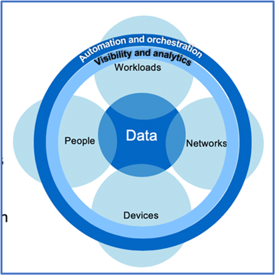
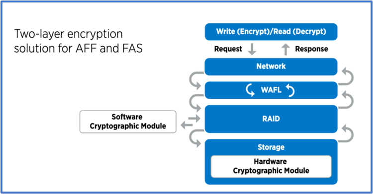
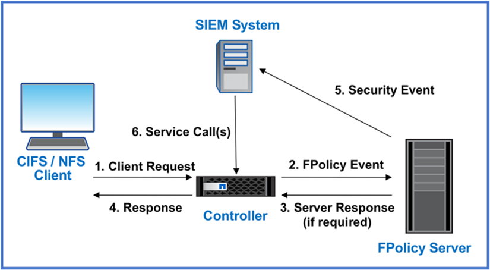

= Architect a data-centric approach to Zero Trust with ONTAP
:icons: font
:imagesdir: ../media/

[.lead]
A Zero Trust network is defined by a data-centric approach in which the security controls should be as close to the data as possible. The capabilities of ONTAP, coupled with the NetApp FPolicy partner ecosystem, can provide the necessary controls for the data-centric Zero Trust model. 

ONTAP is security-rich data management software from NetApp, and the FPolicy Zero Trust Engine is an industry-leading ONTAP capability that provides a granular, file-based event notification interface. NetApp FPolicy partners can use this interface to provide greater illumination of data access within ONTAP.

== Architect a Zero Trust data-centric MCAP

To architect a data-centric Zero Trust MCAP, follow these steps:

. Identify the location of all organizational data.
. Classify your data.
. Securely dispose of data that you no longer require.
. Understand what roles should have access to the data classifications.
. Apply the principle of least privilege to enforce access controls.
. Use multifactor authentication for administrative access and data
access.
. Use encryption for data at rest and data in flight.
. Monitor and log all access.
. Alert suspicious access or behaviors.

=== Identify the location of all organizational data

The FPolicy capability of ONTAP coupled with the NetApp Alliance Partner
ecosystem of FPolicy partners lets you identify where your
organization's data exists and who has access to it. This is done with
user behavioral analytics, which identifies whether data access patterns
are valid. More details about user behavioral analytics are discussed in
Monitor and log all access. If you do not understand where your data is
and who has access to it, user behavioral analytics can provide a
baseline to build classification and policy from empirical observations.

=== Classify your data

In the terminology of the Zero Trust model, classification of data
involves identification of toxic data. Toxic data is sensitive data that
is not intended to be exposed outside an organization. Disclosure of
toxic data could violate regulatory compliance and damage an
organization's reputation. In terms of regulatory compliance, toxic data
includes cardholder data for the
https://www.netapp.com/us/media/tr-4401.pdf[[.underline]#Payment Card
Industry Data Security Standard (PCI-DSS)#], personal data for the EU
https://www.netapp.com/us/info/gdpr.aspx[[.underline]#General Data
Protection Regulation (GDPR)#], or healthcare data for the
https://www.hhs.gov/hipaa/for-professionals/privacy/laws-regulations/index.html[[.underline]#Health
Insurance Portability and Accountability Act (HIPAA)#]. You can use
NetApp https://bluexp.netapp.com/netapp-cloud-data-sense[BlueXP
Classification] (formerly known as Cloud Data Sense), an AI-driven
toolkit to automatically scan, analyze, and categorize your data.

=== Securely dispose of data you no longer require

After classifying your organization's data, you might discover that some
of your data is no longer necessary or relevant to the function of your
organization. The retention of unnecessary data is a liability, and such
data should be deleted. For an advanced mechanism to cryptographically
erase data, see the description of secure purge in Data at rest
encryption.

=== Understand what roles should have access to the data classifications and apply the principle of least privilege to enforce access controls

Mapping access to sensitive data and applying the principle of least
privilege means giving people in your organization access to only the
data required to perform their jobs. This process involves role-based
access control
(https://docs.netapp.com/ontap-9/topic/com.netapp.doc.pow-adm-auth-rbac/home.html[RBAC]),
which applies to data access and administrative access.

With ONTAP, a storage virtual machine (SVM) can be used to segment
organizational data access by tenants within an ONTAP cluster. RBAC can
be applied to data access as well as administrative access to the SVM.
RBAC can also be applied at the cluster administrative level.

In addition to RBAC, you can use ONTAP
https://docs.netapp.com/us-en/ontap/multi-admin-verify/index.html[multi-admin
verification] (MAV) to require one or more administrators to approve
commands such as volume delete or volume snapshot delete. Once MAV is
enabled, modifying or disabling MAV requires MAV administrator approval.

Another way of protecting Snapshot copies is with ONTAP
https://docs.netapp.com/us-en/ontap/snaplock/snapshot-lock-concept.html[Snapshot
copy locking]. Snapshot copy locking is a SnapLock capability where
Snapshot copies are rendered indelible manually or automatically with a
retention period on the volume Snapshot copy policy. Snapshot copy
locking is also referred to as tamper-proof Snapshot copy locking. The
purpose of Snapshot copy locking is to prevent rogue or untrusted
administrators from deleting Snapshot copies on the primary and
secondary ONTAP systems. Rapid recovery of locked Snapshot copies on
primary systems can be achieved in order to restore volumes corrupted by
ransomware.

=== Use multifactor authentication for administrative access and data access

In addition to cluster administrative RBAC,
https://www.netapp.com/us/media/tr-4647.pdf[[.underline]#multifactor
authentication (MFA)#] can be deployed for ONTAP web administrative
access and Secure Shell (SSH) command-line access. MFA for
administrative access is a requirement for U.S. public sector
organizations or those that must follow the PCI-DSS. MFA makes it
impossible for an attacker to compromise an account using only a
username and password. MFA requires two or more independent factors to
authenticate. An example of two-factor authentication is something a
user possesses, such as a private key, and something a user knows, such
as a password. Administrative web access to NetApp ONTAP System Manager
or ActiveIQ Unified Manager is enabled by Security Assertion Markup
Language (SAML) 2.0. SSH command-line access uses chained two-factor
authentication with a public key and password.

You can control user and machine access through APIs with the identity
and access management capabilities in ONTAP:

* User:
** *Authentication and authorization.* Through NAS protocol capabilities
for SMB and NFS.
** *Audit.* Syslog of access and events. Detailed audit logging of CIFS
protocol to test authentication and authorization policies. Fine
granular FPolicy auditing of detailed NAS access at the file level.

* Device:
** *Authentication.* Certificate-based authentication for API access.
** *Authorization.* Default or custom role-based access control (RBAC).
** *Audit.* Syslog of all actions taken.

=== Use encryption for data at rest and data in flight

==== Data at rest encryption

Each day, there are new requirements for mitigating storage-system risks and infrastructure gaps when an organization repurposes drives, returns defective drives, or upgrades to larger drives by selling or trading them in. As administrators and operators of data, storage engineers are expected to manage and maintain data securely throughout its lifecycle. https://www.netapp.com/us/media/ds-3898.pdf[NetApp Storage Encryption (NSE)&#44; NetApp Volume Encryption (NVE)&#44; and NetApp Aggregate Encryption] help you encrypt all your data at rest all the time, whether or not it is toxic, and without affecting daily operations. https://www.netapp.com/us/media/ds-3213-en.pdf[NSE] is an ONTAP hardware data-at-rest solution that makes use of FIPS 140-2 level 2 validated self-encrypting drives. https://www.netapp.com/us/media/ds-3899.pdf[NVE and NAE] are an ONTAP software data-at-rest solution that makes use of the https://csrc.nist.gov/projects/cryptographic-module-validation-program/certificate/4144[FIPS 140-2 level 1 validated NetApp Cryptographic Module]. With NVE and NAE, either hard drives or solid-state drives can be used for data-at-rest encryption. Plus, NSE drives can be used to provide a native, layered encryption solution that provides encryption redundancy and additional security. If one layer is breached, then the second layer still secures the data. These capabilities make ONTAP well positioned for https://www.netapp.com/us/media/sb-3952.pdf[quantum-ready encryption].

NVE also provides a capability called https://blog.netapp.com/flash-memory-summit-award/[secure purge] that cryptographically removes toxic data from data spills when sensitive files are written to a non-classified volume.

Either the https://docs.netapp.com/ontap-9/topic/com.netapp.doc.pow-nve/GUID-466E3BFC-F7FA-4B79-A8C9-2540C3BF1408.html[Onboard Key Manager (OKM)], which is the key manager built in to ONTAP, or https://mysupport.netapp.com/matrix/imt.jsp?components=69551;&solution=1156&isHWU&src=IMT[approved] third-party https://docs.netapp.com/ontap-9/topic/com.netapp.doc.pow-nve/GUID-DD718B42-038D-4009-84FF-20BBD6530BC2.html[external key managers] can be used with NSE and NVE to securely store keying material.

As seen in figure 2 above, hardware and software based encryption can be combined. This capability led to the https://www.netapp.com/blog/netapp-ontap-CSfC-validation/[validation of ONTAP into the NSA's commercial solutions for classified program] that allows for storage of top secret data.

==== Data-in-flight encryption
ONTAP data-in-flight encryption protects user data access and control-plane access. User data access can be encrypted by SMB 3.0 encryption for Microsoft CIFS share access or by krb5P for NFS Kerberos 5. User data access can also be encrypted with https://docs.netapp.com/us-en/ontap/networking/configure_ip_security_@ipsec@_over_wire_encryption.html[IPsec] for CIFS, NFS, and iSCSI. Control plane access is encrypted with Transport Layer Security (TLS). ONTAP provides https://docs.netapp.com/ontap-9/topic/com.netapp.doc.dot-cm-cmpr-950/security_config_modify.html[FIPS] compliance mode for control plane access, which enables FIPS-approved algorithms and disables algorithms that are not FIPS approved. Data replication is encrypted with https://docs.netapp.com/ontap-9/topic/com.netapp.doc.pow-csp/GUID-D58CC065-5EB5-4887-9A64-714755CC5B51.html[cluster peer encryption]. This provides encryption for the ONTAP SnapVault^®^ and SnapMirror^®^ technologies.

=== Monitor and log all access
After RBAC policies are in place, you must deploy active monitoring, auditing, and alerting. The FPolicy Zero Trust Engine from NetApp ONTAP, coupled with the https://www.netapp.com/partners/partner-connect[NetApp FPolicy partner ecosystem], provides the necessary controls for the data-centric Zero Trust model. NetApp ONTAP is security-rich data management software, and https://docs.netapp.com/ontap-9/topic/com.netapp.doc.dot-cifs-nfs-audit/GUID-F1F54C15-057A-460E-A5E1-21FFBB9773FA.html[FPolicy] is an industry-leading ONTAP capability that provides a granular file-based event notification interface. NetApp FPolicy partners can use this interface to provide greater illumination of data access within ONTAP. The FPolicy capability of ONTAP, coupled with the NetApp Alliance Partner ecosystem of FPolicy partners, lets you identify where your organization's data exists and who has access to it. This is done with user behavioral analytics, which identifies whether data access patterns are valid. User behavioral analytics can be used to alert for suspicious or aberrant data access that is out of the normal pattern and, if necessary, take actions to deny access.

FPolicy partners are moving beyond user behavioral analytics toward machine learning (ML) and artificial intelligence (AI) for greater event fidelity and fewer, if any, false positives. All events should be logged to a syslog server or to a security information and event management
(SIEM) system that can also employ ML and AI.

NetApp's Storage Workload Security (formerly known as https://docs.netapp.com/us-en/cloudinsights/cs_intro.html[Cloud Secure]) makes use of the FPolicy interface and user behavioral analytics on both cloud and on-premises ONTAP storage systems to give you real-time alerts of malicious user behavior. Storage Workload Security protects organizational data from being misused by malicious or compromised users through advanced machine learning and anomaly detection. Storage Workload Security can identify ransomware attacks or other miscreant behaviors, invoke Snapshot copies and quarantine malicious users. Storage Workload Security also has a forensics capability to view in great detail user and entity activities. Storage Workload Security is a part of NetApp Cloud Insights.

In addition to Storage Workload Security, ONTAP has an onboard ransomware detection capability known as link:../anti-ransomware/index.html[Autonomous Ransomware Protection] (ARP). ARP uses machine learning to determine if abnormal file activity indicates a ransomware attack is underway and invokes a Snapshot copy and alert to administrators. Storage Workload Security integrates with ONTAP to receive ARP events and provides an additional analytics and automatic responses layer.